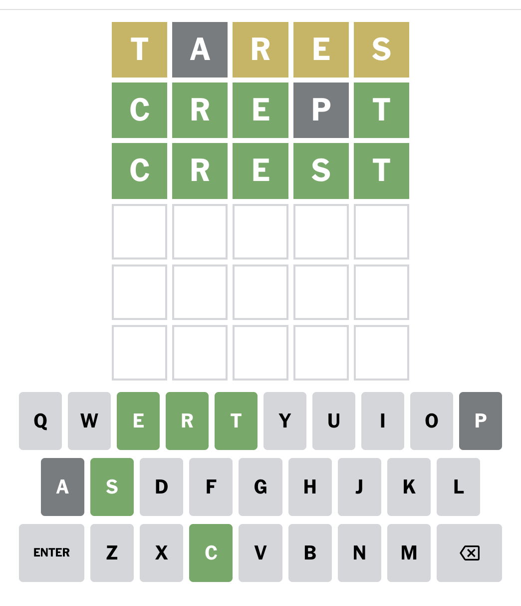

# Wordle solver

This program solves wordle puzzles. You can use the provided ipython notebook
interactively to play a wordle puzzle.

You make a move, then tell this program the move you made and the response you
got. Then you ask it, "What's the best move now?"

# What's the best first move?

It's "tares".

Other very good first moves: lares, rales, rates, tales, arles, nares, tears, tores, reals.

Of course this depends on what dictionary you use.

# Sample session



You initialize so:

```
import wordle
dictionary = [x.strip() for x in open("dictionary.txt").readlines()]
dictionary = [x.lower() for x in dictionary if len(x) == 5]
game = wordle.GameState(set(dictionary))
```

You play "tares", because it's the best first move. The game responds "yellow
grey yellow yellow yellow", i.e., "wrong-place not-present wrong-place
wrong-place wrong-place".

You run `game.eliminate('tares', 'wnwww')` to tell the solver what you played
and what the response was. Then, you run `game.best_move()` to ask it what the
best next move is.

It prints out the top 10 best next moves:

```
[('crept', 1.8891591637540217), ('crepe', 1.8891591637540215), ('scend', 1.8310204811135165), ('swede', 1.8310204811135165), ('spend', 1.8310204811135162), ('prese', 1.8310204811135162), ('price', 1.7351264569629226), ('pride', 1.7351264569629226), ('pence', 1.7351264569629226), ('pedro', 1.7351264569629226)]
```

and returns `crept`. You play `crept`. The game says "right right right
not-present right". You update the game: `game.eliminate('crept', 'rrrnr')`. The
solver prints

```
Before: 9 possibilities
After: 1 possibilities
{'crest'}
```

So you finally play `crest` and win the game. Note that you don't need to run
`game.best_move()` at the end because there's only one possible answer
consistent with the moves and responses so far.

# How it works

Here's an explanation copy-pasted from a comment in the code:

The best move is the one that gives us "most information".

To develop some intuition, imagine playing a move such that, for all
possible true answers, the game would produce the same response. It is
useless to play this move. Playing it gives us no information. The
distribution of responses over answers looks like a big spike. The
precise way of saying that is that this distribution has low entropy.

Imagine playing a move that elicits a different response from the game
for each different possible answer. That would be amazing! We would
play this move. The game would give us its response. We would eliminate
all answers that are inconsistent with that response, leaving the one
and only true answer. We win the game next move. The precise way of
saying that is that this distribution has high entropy.

Another way of saying this is that a good move is one where, no matter
what the true answer is, you'll end up eliminating a lot of 
possibilities once you hear the response. Entropy is a way of making
that intuition formal.

This function computes the entropy of the response distribution for
each possible move, by iterating over each possible answer for each
move. Then, it returns the move with highest response entropy.

A key insight is that the history of past moves doesn't matter except
in that it tells us which words are still possible contenders for being
the answer.

# Known bugs and limitations

## Repeat letters
It doesn't deal with repeat letters correctly I think. The overall mathematical
framework is correct, but I think the `predict` function is incorrect.

## Slow
The first call to `eliminate` is slow. I'm tempted to rewrite this in Rust, and if 
that's still a bit too slow, then parallelizing. The computation is embarrassingly
parallel so that's definitely worth a shot.
